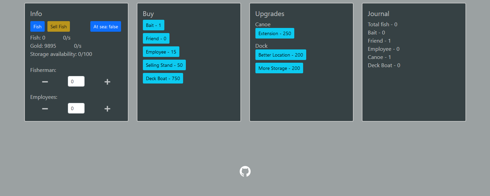

# larryfisherman

larryfisherman is a incremental open source game that is suppose to be played on the browser, the theme of the game is fishing but if some mechanics or actions dont make sense dont take it too seriously.

## Roadmap
To see the current state of development and the upcoming features you can check out the trello for the project
- [Trello](https://trello.com/b/hDq5CJEx/larry-fisherman)

## Feedback
If you wanna give any feedback on actual functionalities or wanna see something implemented you can reach out to me by emailing me at bmp.antunes@protonmail.com (you can use a temporary email if you just want to make a anonymous contribution)